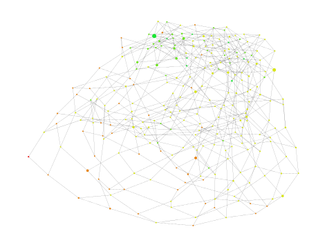

# Tournesol-Stats
A collection of tools to visualize and explore the tournesol.app public dataset.

## General Setup

### Python

These scripts runs with Python version 3.

Development uses Python version 3.9.5, previous versions may also work (not tested).

Some dependencies may be needed to be installed to run the project prior to its execution.

(TODO: Automatic setup)

### API Key configuration

These scripts uses Youtube API to process data, and need to acces an API Key to work.
The API Key will be found in `~/Documents/YT_API_KEY.txt` file (currently hardcoded into the scripts, this very path is mandatory, or change the source according to your preferred location)

Create a file in `TournesolStats/data/YT_API_KEY.txt`, and paste your youtube API key in (TODO: document how to find the YT API key)

(For comparison, this readme you're reading is: `TournesolStats/README.md`)

For information, API consumption is low, and will cache all collected data (maximum is 1 request for every 50 video the user (parameter) compared)

### Tournesol Data

These scripts need tournesol public dataset, extracted into any directory on your computer. It will be needed to specify where this repository is to the script arguments (see "How to use" below).

In the footer of [tournesol.app] website, there is a link to download the public dataset.

Get the dataset (downloaded as a zip archive), and unzip-it anywhere you like on your computer.

These scripts need the structure of the unzipped archive to be unchanged to work. Do not move or rename any file from the dataset.

-----
-----

## Tools

### Graphing tool ('graph.py')

Create a graph, as a .svg file, representing the user's comparisons.

- Videos are vertices
	- Color depends on language (colors are ranomly selected)
	- Size depends on number of comparisons made with it
- Comparisons are edges
	- Black edges are comparisons set by the given user
	- Gray edges are comparisons set by other users (wider depending on how many users did the comparison)
	- Green edges are recommended comparisons between seen videos
		- recommended to best reduce the average distance between videos on the graph

#### How to use

`py src/graph.py <public-dataset-dir> <yt-data-cache-file> <username>`

Example:
`py src/main.py data/tournesol_dataset data/YTData_cache.json NatNgs`

Can take about 10minutes (if user has a lot of comparisons) to generate (it will log progression every second)
`35 iterations/4.2s (8.33ips) - move:63.8`
- how many iterations has been done to optimize the graph disposition
- how much time did it work
- how many iterations per seconds it is optimizing
- move: how much dit the last optimization modified the graph (big number = huge change, low number = almost no change)

Will generate the output png file as `TournesolStats/data/output/graph_<username>.svg` (e.g. `graph_NatNgs.svg`)

#### Known Limitations

- May not work as intended, or produce an unreadable picture for users with "not enough" or "too much" comparisons done (depends on your appreciation)
- Not supporting emojis and some symbols (will print squares instead) - may depend on your computer/execution environment
- Non-perfect Recommendations: Does not take into account videos that have not been compared by the selected user
	- A step of the algorithm computes the shortest distance between nodes, and result may be different with full dataset
- No Unit test => May contain bugs

-----

### Video Graph ('video_graph.py')

	

Compute and display simple graph with various parameters

- Nodes represents videos
- Edges represents comparisons
- Can filter (or not) on a specific user
- Can filter (or not) on a specific date (will get only comparisons made after it)
- Can compute nodes (videos) colors according to different data
	- score : Tournesol largely_recommended score of the video (red->green for low->high score)
	- degree : Number of others videos one has been compared to (red->green for few->many comparisons)
	- distmax : Distance to the largest node (red->green for near->far)
	- closeness : Closeness Centrality value of the node (see google)
	- katz : Katz Centrality value of the node (see google)
	- rndwalk : Betweenness Centrality value of the node (see google)

#### How to use

To run with default configuration:
`py src/video_graph.py`

Show help for more personalized settings:
`py src/video_graph.py -h`

-----

### Users Graph ('users_graph.py')

	

Compute and display simple graph with various parameters

- Nodes represents users
	- Node color depends on the date of user first comparison (red = ancient, green = average, blue = recent)
	- Node size depends on how many different video the user has compared
- Edges represents similarities between users
	- Similarity is how many videos they have compared in common (ignoring what score they gave)
	- Only shown if significant similarities between users
	- Will be shorter, wider and less transparent as the number of shared videos increases

- Can filter (or not) on a specific date (will get only comparisons made after it)

#### How to use

To run with default configuration: \
`py src/users_graph.py`

Show help for more personalized settings: \
`py src/users_graph.py -h`

-----

### Tags Statistics ('tags_stats.py')

Compute and print average Tournesol rating for every youtube videos tags present in the dataset

#### How to use

To run with default configuration: \
`py src/tags_stats.py`

Show help for more personalized settings: \
`py src/tags_stats.py -h`

-----

### Random Statistics ('rnd_stats.py')

Show various statistics from the dataset

#### How to use

`py src/rndstats.py <tournesol-dataset-dir> (<username>)`

Example (to show only general statistics): \
`py src/rndstats.py data/input/tournesol_dataset`

Example (to show also given user statistics): \
`py src/rndstats.py data/input/tournesol_dataset NatNgs`

#### Setup

Depends on file `data/YTData_cache.json` to be present, or will create it otherwise, using Youtube API Key located in `~/Documents/YT_API_KEY.txt`

-----

### Comparison Challenge Generator ('challenge.py')

Suggest comparisons of videos having received similar comparisons.

The idea is so that every video is compared with at least one more recommended one, and at lease one less recommended one, so the global rating of the video can be somewhat capped by the top AND by the bottom, and so improve the global scoring.

#### How to use

To run with default configuration: \
`py src/challenge.py`

Show help for more personalized settings: \
`py src/challenge.py -h`

Example (Using specified dataset, and challenging only the user `NatNgs`' comparisons): \
`py src/challenge.py -t data/tournesol_dataset -u NatNgs`

-----
-----

## LICENSE

GNU AFFERO GENERAL PUBLIC LICENSE

Permissions of this strongest copyleft license are conditioned on making available complete source code of licensed works and modifications, which include larger works using a licensed work, under the same license. Copyright and license notices must be preserved. Contributors provide an express grant of patent rights. When a modified version is used to provide a service over a network, the complete source code of the modified version must be made available.

See LICENSE.txt file for details.
